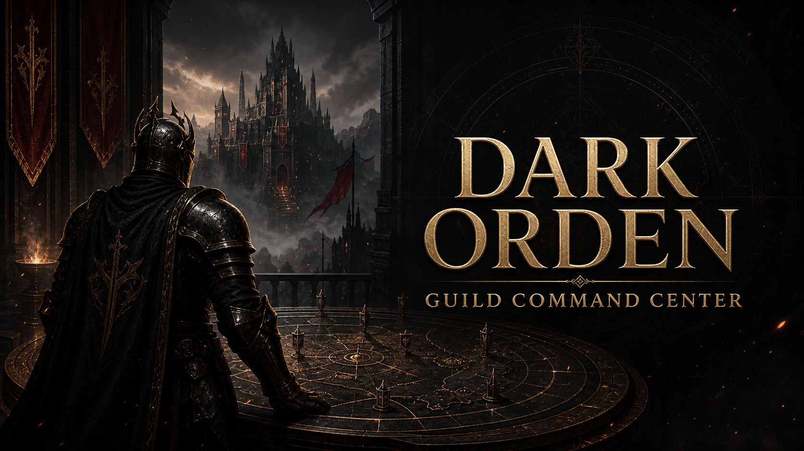

# Dark Orden — Guild Command Center

## [🚀 ЗАПУСТИТЬ ПРИЛОЖЕНИЕ В БРАУЗЕРЕ](https://dark-orden-guild-hub.rkvvx28vrb.chatgpt.site)

[](https://dark-orden-guild-hub.rkvvx28vrb.chatgpt.site)

Полноценная первая версия CRM-системы для гильдии **Dark Orden** в Black Desert Mobile. Сейчас приложение закрывает базовый контур аккаунта: регистрация, авторизация, защищённая сессия, редактируемый профиль, выход и личный кабинет участника.

> Фанатский проект сообщества. Не связан с Pearl Abyss и не использует официальные игровые материалы.

## Содержание

- [Что уже работает](#что-уже-работает)
- [Безопасность](#безопасность)
- [Архитектура и SOLID](#архитектура-и-solid)
- [Технологии](#технологии)
- [Локальный запуск](#локальный-запуск)
- [Полезные команды](#полезные-команды)
- [Развёртывание](#развёртывание)
- [Текущие ограничения](#текущие-ограничения)
- [План развития](#план-развития)

## Что уже работает

- регистрация по имени персонажа, логину и паролю;
- закрытая регистрация по идентификатору гильдии;
- автоматическое добавление нового аккаунта в гильдию `Dark Orden`;
- проверка уникальности логина;
- вход по логину и паролю;
- сохранение защищённой сессии на семь дней;
- автоматическая проверка сессии после перезагрузки страницы;
- изменение игрового ника прямо в личном кабинете;
- добавление необязательного реального имени;
- неизменяемый логин для безопасного входа;
- безопасный выход с удалением серверной сессии;
- личный кабинет участника;
- базовые роли `owner`, `officer` и `member`;
- адаптивный интерфейс для компьютеров, планшетов и телефонов;
- русскоязычные проверки форм и понятные сообщения об ошибках;
- оригинальный фирменный арт и Open Graph-превью.

## Безопасность

- пароли никогда не сохраняются в открытом виде;
- используется `PBKDF2-SHA-256` с максимально допустимыми на платформе 100 000 итераций и индивидуальной 128-битной солью;
- токен сессии генерируется из 256 бит криптографически стойкой случайности;
- в базе хранится только SHA-256-хеш токена сессии;
- браузер получает сессию через `HttpOnly`, `SameSite=Lax` и `Secure` cookie;
- изменяющие запросы проходят проверку источника;
- ответы авторизации не кешируются;
- настроены CSP, защита от встраивания страницы и ограничение разрешений браузера;
- сервер и клиент независимо проверяют регистрационные данные;
- идентификатор регистрации проверяется только на сервере и хранится как секрет окружения;
- производственные зависимости проходят `npm audit --omit=dev` без известных уязвимостей.

## Архитектура и SOLID

Проект разделён на четыре независимых слоя:

```text
app/              интерфейс, формы, кабинет и HTTP-маршруты
application/      сценарии регистрации, входа, профиля, сессии и выхода
domain/           модели, правила проверки и контракты
infrastructure/   D1-репозитории, криптография и системные сервисы
```

Принципы SOLID применены следующим образом:

- **Single Responsibility:** формы, сценарии, репозитории и криптография отвечают каждый за одну задачу;
- **Open/Closed:** Discord, другая база или внешний провайдер входа подключаются через новые реализации контрактов;
- **Liskov Substitution:** реализации репозиториев и сервисов можно заменять без изменения сценариев;
- **Interface Segregation:** хранение пользователей, изменение профиля, сессии, хеширование и генерация токенов разделены;
- **Dependency Inversion:** бизнес-сценарии зависят от интерфейсов домена, а не от Cloudflare D1.

Такая структура позволяет будущему Discord-боту использовать те же серверные сценарии и базу без прямой зависимости от интерфейса сайта.

## Технологии

- TypeScript;
- React;
- Next.js и Vinext;
- Cloudflare Workers;
- Cloudflare D1;
- Drizzle ORM и SQL-миграции;
- Lucide Icons;
- CSS с адаптивной вёрсткой;
- Node.js Test Runner и ESLint.

## Локальный запуск

Требуется Node.js `22.13.0` или новее.

```bash
git clone https://github.com/dirana21/Dark-Orden-Bot.git
cd Dark-Orden-Bot
npm ci
cp .dev.vars.example .dev.vars
npm run dev
```

Перед запуском укажите локальный идентификатор гильдии в `.dev.vars`. После запуска откройте `http://localhost:3000`. Локальная база создаётся автоматически внутри каталога разработки.

## Полезные команды

```bash
npm run dev          # локальный сервер
npm run build        # производственная сборка
npm test             # сборка и автоматические проверки
npm run lint         # проверка качества кода
npm run db:generate  # генерация SQL-миграций
```

## Развёртывание

Приложение содержит серверную авторизацию и базу данных, поэтому оно не является обычной статической страницей GitHub Pages. Исходный код хранится на GitHub, а рабочая версия развёрнута как серверное браузерное приложение с Cloudflare D1.

Рабочий адрес: [dark-orden-guild-hub.rkvvx28vrb.chatgpt.site](https://dark-orden-guild-hub.rkvvx28vrb.chatgpt.site)

Логины, пароли и токены не записываются в репозиторий.

## Текущие ограничения

- поддерживается одна гильдия — `Dark Orden`;
- новый пользователь получает роль `member`;
- восстановление пароля по email пока отсутствует;
- управление составом, события и Discord-интеграция показаны как следующие модули;
- единый идентификатор позднее желательно заменить одноразовыми приглашениями или одобрением офицера.

## План развития

1. Панель управления составом и ролями.
2. Приглашения и подтверждение новых участников.
3. Журнал активности и события гильдии.
4. Привязка аккаунта Discord.
5. Защищённый API для Discord-бота.
6. Автоматический импорт сообщений и отчётов из Discord.
7. Создание собственных гильдий и вступление по приглашению.
8. Разделение данных нескольких гильдий.
9. Восстановление пароля и подтверждение email.
10. Аудит действий офицеров и владельцев.
